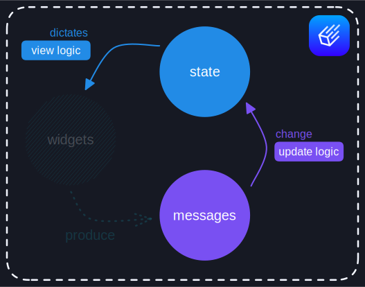

> This chapter documents [a revision of iced] not yet officially released. If you enjoy living on the edge,
> you can directly rely on this revision in your `Cargo.toml`:
>
> ```toml
> [dependencies.iced]
> git = "https://github.com/iced-rs/iced.git"
> rev = "9152904af1630a6d373b2fd7c284835bf0a3ca95"
> ```

[a revision of iced]: https://github.com/iced-rs/iced/tree/9152904af1630a6d373b2fd7c284835bf0a3ca95

# The Runtime

We can call this `view` method anytime to obtain the latest widgets of our counter interface. For instance, we could keep
simulating a user and some interactions:

```rust
// Initialize our state
let mut counter = Counter { value: 0 };

// Simulate some interactions
counter.update(Message::Increment);
counter.update(Message::Increment);
counter.update(Message::Decrement);

// Dictate the interface
let interface = counter.view();
```

<div align="center">
  
</div>
